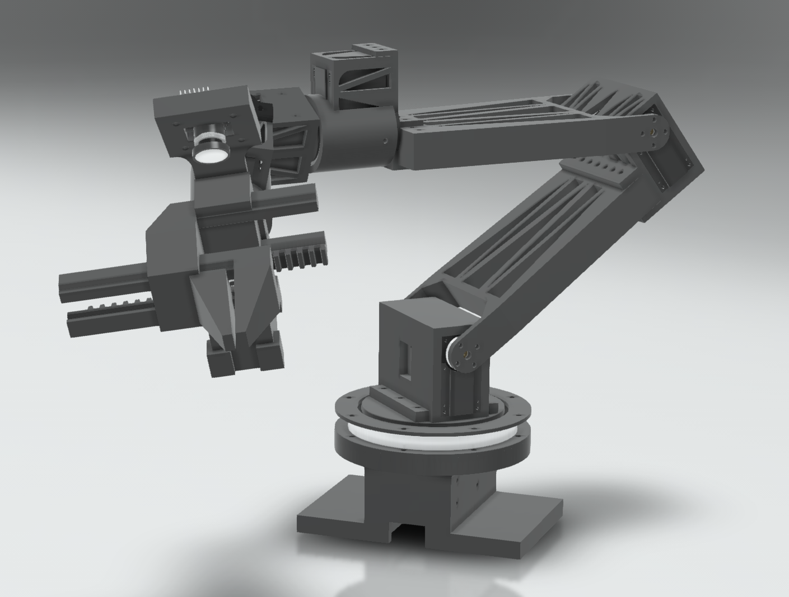
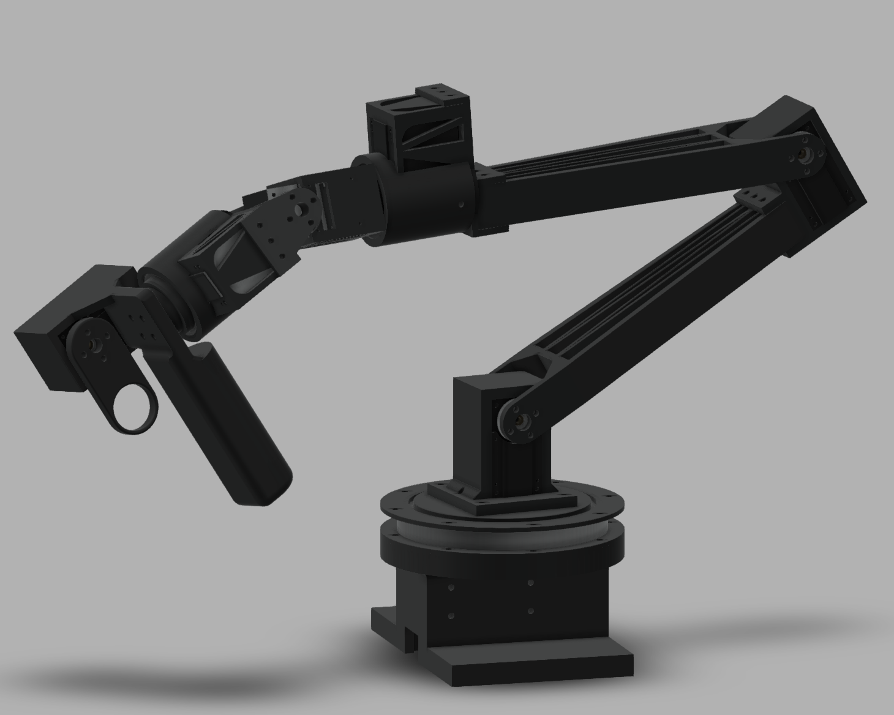

<p align="center">
  
</p>

<p align="center">
  <a href="https://nextis.tech">
    
  </a>
  <a href="https://a360.co/4pqJisO">
    
  </a>
  <a href="https://a360.co/4ijg64y">
    
  </a>
  <a href="https://huggingface.co/datasets/robertodlcg/umbra03">
    
  </a>
</p>

<h1 align="center">Umbra Mark II</h1>
<p align="center"><strong>A high-performance, open-source leader-follower robotic arm</strong></p>
<p align="center">Designed and built by <strong>Nextis</strong> • Powered by <a href="https://huggingface.co/lerobot">LeRobot</a></p>

## Demo

<p align="center">
  <!-- Clickable thumbnail linking to raw video for direct play/download -->
  <a href="https://raw.githubusercontent.com/FLASH-73/end2end_framework/main/media/teleoperate_demo.gif" target="_blank">
    
  </a>
  <br>
  <em>Click image to play full teleoperation demo (GIF) • Real-time leader → follower control</em>
</p>

## Interactive 3D CAD Models (Autodesk Fusion 360)

<table align="center">
  <tr>
    <td width="50%">
      <a href="https://a360.co/4pqJisO" target="_blank">
        <strong>Umbra Mark II – Follower Arm</strong><br>
        
      </a>
    </td>
    <td width="50%">
      <a href="https://a360.co/4ijg64y" target="_blank">
        <strong>Umbra Mark II – Leader Arm</strong><br>
        
      </a>
    </td>
  </tr>
</table>

> Click images above for fully interactive 3D viewer • Also available as downloadable STEP files in `/hardware`

## Features

- Full seamless integration with Hugging Face **LeRobot** (record, train, eval)
- High-precision Feetech STS-series servos
- Gravity-compensated passive leader arm for natural teleoperation
- Dual-camera setup (main + wrist)
- Bimanual-ready architecture (`bi_umbra_follower` / `bi_umbra_leader`)
- Docker + docker-compose for 100% reproducible environment

## Hardware Overview

| Component                  | File in Repo                                 | Format  |
|---------------------------|-----------------------------------------------|---------|
| Full Follower Assembly    | `hardware/mark_II_follower assembly.step`     | STEP    |
| Full Leader Assembly      | `hardware/MarkII_leader_assembly.step`        | STEP    |
| Fusion 360 Archive        | `hardware/assembled Mark II.f3z`              | .f3z    |
| Photos                    | `media/markII_follower_assembled.png`<br>`media/markII_leader_assembled.png` | PNG     |

## Quick Start (Docker – Recommended)

```bash
git clone https://github.com/Nextis/umbra.git
cd umbra/end2end_framework

# Build and start (automatically installs LeRobot + your custom arm)
docker compose up --build